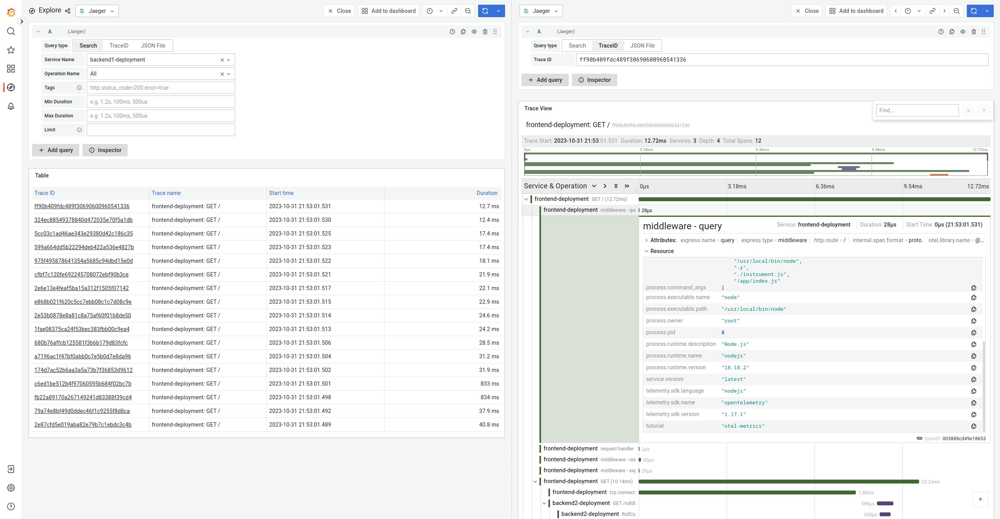
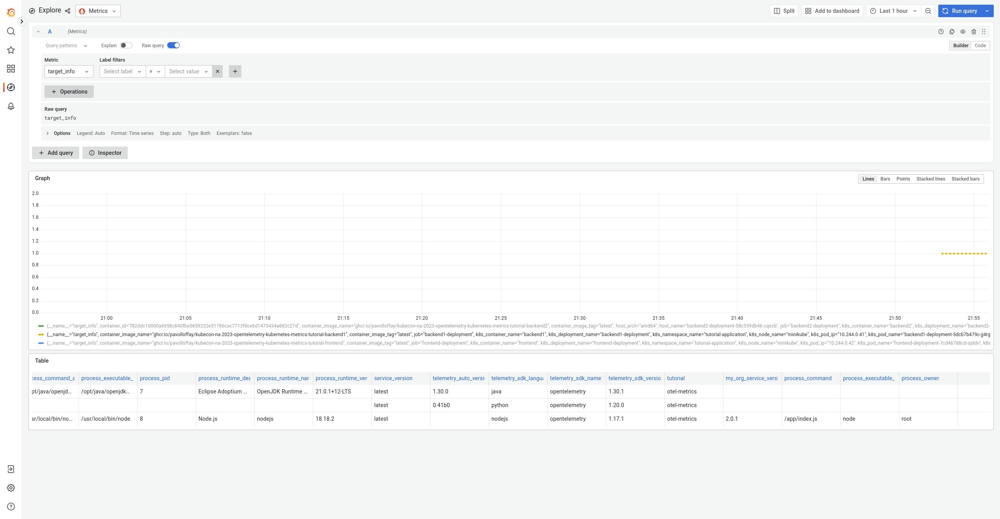

# Correlation 

SRE workflow usually starts by a triggered alert with metric that went over a threshold.
From there the investigation starts by looking at logs and traces. Therefore, it is important 
to be able to correlate these three signal types together.

In general all signals can be correlated by time and resource (from where the data was reported). 
However, there are other correlation techniques as well e.g. trace exemplars.

In this chapter we are going to look at:
* collecting Kubernetes resource attributes
* exemplars
* baggage

## Collecting Kubernetes resource attributes

In the Kubernetes environment it is crucial to identify from where the telemetry data was reported.
It is important to know exactly which container, pod or deployment created the data but as well on which
node and cluster it was running.

The [Kubernetes resource attributes](https://github.com/open-telemetry/semantic-conventions/blob/main/docs/resource/k8s.md) are prefixed with `k8s`: `k8s.pod.name`, `k8s.pod.uid` etc.

The Kubernetes resource attributes can be added to metrics in a couple of different ways:
1. in OpenTelemetry SDK / `OTEL_RESOURCE_ATTRIBUTES` environment variable
2. in collector [k8sattributesprocessor](https://github.com/open-telemetry/opentelemetry-collector-contrib/tree/main/processor/k8sattributesprocessor)

### OpenTelemetry SDK / `OTEL_RESOURCE_ATTRIBUTES`

The resource attributes can be specified at SDK initialization time [frontent/instrument.js](./app/frontend/instrument.js).

The OpenTelemetry operator injects `OTEL_RESOURCE_ATTRIBUTES` with Kubernetes resource attributes to the application container in a pod which injects the OpenTelemetry collector as a sidecar.
The operator uses Kubernetes downward API to get Kubernetes attributes.

```bash
sidecar.opentelemetry.io/inject: "true"
```

### k8s Attributes Processor

This processor is the most sophisticated processor for collecting Kubernetes resource attributes.
It as well allows to collect pod, namespace and node labels and annotations.

The k8sattributeprocessor queries k8s API server to discover all running pods in a cluster.
It keeps a record of their IP addresses, pod UIDs and interesting metadata.
The rules for associating the data passing through the processor (spans, metrics and logs) with specific Pod Metadata are configured via `pod_association` key.
By default, it associates the incoming connection IP to the Pod IP.

The processor requires following RBAC to query the API server:

```yaml
apiVersion: v1
kind: ServiceAccount
metadata:
  name: collector
  namespace: <OTEL_COL_NAMESPACE>
---
apiVersion: rbac.authorization.k8s.io/v1
kind: ClusterRole
metadata:
  name: otel-collector
rules:
- apiGroups: [""]
  resources: ["pods", "namespaces"]
  verbs: ["get", "watch", "list"]
- apiGroups: ["apps"]
  resources: ["replicasets"]
  verbs: ["get", "list", "watch"]
- apiGroups: ["extensions"]
  resources: ["replicasets"]
  verbs: ["get", "list", "watch"]
---
apiVersion: rbac.authorization.k8s.io/v1
kind: ClusterRoleBinding
metadata:
  name: otel-collector
subjects:
- kind: ServiceAccount
  name: collector
  namespace: <OTEL_COL_NAMESPACE>
roleRef:
  kind: ClusterRole
  name: otel-collector
  apiGroup: rbac.authorization.k8s.io
```

```yaml
  processors:
    k8sattributes:
      passthrough: false # when true only pod IP addresses are added, that can be used later for attributes association
      extract:
        annotations:
          - tag_name: tutorial # extracts value of annotation from pods with key `annotation-one` and inserts it as a tag with key `a1`
            key: kubecon-tutorial
            from: namespace
```

Let's create a collector with the k8s attribute processor:
```bash
kubectl apply -f https://raw.githubusercontent.com/pavolloffay/kubecon-na-2023-opentelemetry-kubernetes-metrics-tutorial/main/backend/07-collector-correlation.yaml
```

And let's see a [trace in Grafana](http://localhost:3000/grafana/explore?orgId=1&left=%7B%22datasource%22:%223Dcp0V4Ik%22,%22queries%22:%5B%7B%22refId%22:%22A%22,%22datasource%22:%7B%22type%22:%22jaeger%22,%22uid%22:%223Dcp0V4Ik%22%7D,%22queryType%22:%22search%22,%22service%22:%22backend1-deployment%22%7D%5D,%22range%22:%7B%22from%22:%22now-1h%22,%22to%22:%22now%22%7D%7D)




## Resource Detection Processor

The [resourcedetectionprocessor](https://github.com/open-telemetry/opentelemetry-collector-contrib/tree/main/processor/resourcedetectionprocessor) can 
be used to detect the resource information from the host. Several detectors are supported:

* `env`: read attributes from  `OTEL_RESOURCE_ATTRIBUTES`
* `system`: `host.name`, `host.arch`, `host.id`, `host.cpu.model.name`,  `host.cpu.vendor.id`
* `docker`: `host.name`, `os.type`
* `heroku`: `heroku.app.id`, `heroku.release.commit`, `service.name`
* `gcp`: `cloud.provider` (`gcp`), `cloud.platform` (`gcp_app_engine`), `cloud.region` (`us-central1`), `cloud.availability_zone` (`us-central1-c`), `gcp.gce.instance.hostname`
* `openshift`: `cloud.provider`, `cloud.platform`, `cloud.region`, `k8s.cluster.name`

```yaml
processors:
    resourcedetection: 
      detectors: [env, system]
      timeout: 2s
      override: false
```

## Exemplars

[Exemplars](https://opentelemetry.io/docs/specs/otel/metrics/sdk/#exemplar) allow correlation
between aggregated metric data and the original API calls where measurements are recorded.
Exemplars work for trace-metric correlation across any metric, not just those that can also be derived from Spans.

* Not all OpenTelemetry SDKs support exemplars:
* https://github.com/open-telemetry/opentelemetry-go/issues/559
* https://github.com/open-telemetry/opentelemetry-js/issues/2594
* https://github.com/open-telemetry/opentelemetry-python/issues/2407

### Spanmetrics Connector

The [spanmetrics](https://github.com/open-telemetry/opentelemetry-collector-contrib/tree/main/connector/spanmetricsconnector) 
connector aggregates Request, Error and Duration (R.E.D) OpenTelemetry metrics from span data.
It supports exemplars.

```yaml
connectors:
  spanmetrics:
    exemplars:
      enabled: true
service:
  pipelines:
    traces:
      receivers: [otlp]
      exporters: [spanmetrics]
    metrics:
      receivers: [spanmetrics]
      exporters: [otlp]
```

## Baggage

[Baggage](https://opentelemetry.io/docs/concepts/signals/baggage/) is contextual information that is passed between spans. 
It is a key-value store that resides alongside span context in a trace, making values available to any span created within that trace.

The baggage is propagated via W3C `baggage` [header](https://w3c.github.io/baggage/).

Example of setting baggage with `sessionId` key.

```javascript
const baggage =
    otelapi.propagation.getBaggage(otelApi.context.active()) ||
    otelapi.propagation.createBaggage()

  baggage.setEntry("sessionId", { value: "session-id-value" })
  otelapi.propagation.setBaggage(otelapi.context.active(), baggage)
```
